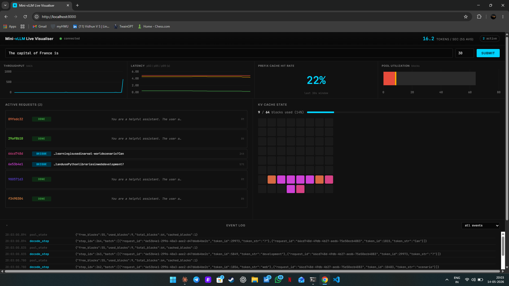

# Mini-vLLM — from-scratch LLM inference engine

> **v0.2: GPU + streaming + prefix caching + metrics shipped.** v0.3 (speculative decoding) in progress.

An educational, from-scratch reimplementation of vLLM's core ideas on
TinyLlama-1.1B-Chat. Continuous batching, paged KV cache (PagedAttention),
and a live WebSocket visualiser of every scheduler decision and cache
block. Built to understand modern LLM inference internals at the
production-engineering level — every line written by hand, with Hugging
Face parity tests as the correctness anchor at each layer of the stack.

## Hero



*Four concurrent requests in the DECODE phase. Each colour is one
request_id, hashed deterministically so the same hue appears in the
status row, the cache grid, and the event log. 9 of 64 KV blocks in
use; ~12.6 tokens/sec on CPU.*

## v0.1 benchmarks

TinyLlama-1.1B-Chat, fp32, CPU. Four concurrent requests, 32 tokens
each. Speedups measured against a sequential `generate()` loop over the
same prompts.

| Configuration | Time | Speedup | Notes |
|---|---|---|---|
| Solo (sequential) | 16.32s | 1.00x | baseline |
| Continuous batching, ample blocks | 5.26s | 3.10x | scheduler parity test |
| + Paged KV cache, ample blocks | 5.35s | 3.27x | paged overhead amortised |
| Paged + tight blocks (6) | 8.78s | 1.79x | admission control under back-pressure |

The fourth row is the interesting one: with only 6 cache blocks the
scheduler must queue some requests until earlier ones free theirs.
Total wall time goes up but correctness is preserved
(`test_paged_scheduler_with_tight_blocks_still_parity`).

## vs production vLLM

mini-vLLM is **not** trying to beat [vLLM](https://github.com/vllm-project/vllm) —
it's trying to make every idea inside vLLM visible and verifiable. So I built an
honest head-to-head against it on identical TinyLlama workloads:
[`scripts/benchmark_vs_vllm.py`](scripts/benchmark_vs_vllm.py).

The result is the expected one for a hand-written teaching engine vs a production
system: **mini-vLLM is roughly an order of magnitude slower on per-token latency
(TPOT), and the throughput gap widens as batch size grows.** That's not a
disappointment — it's the receipt. Each slowdown maps to one named production
technique that v1 of mini-vLLM intentionally omits for clarity:

- **TPOT** — vLLM replays a captured **CUDA graph** (one launch); mini-vLLM does
  eager PyTorch dispatch (hundreds of kernel launches) per step.
- **Throughput at batch=8** — vLLM's **C++ scheduler** + paged-attention CUDA
  kernels keep the GPU saturated; our Python `step()` loop pays host overhead
  that grows with batch size.
- **TTFT** — vLLM's **async engine** overlaps tokenisation/scheduling; mini-vLLM
  admits synchronously on one thread.
- **fp32-for-parity tax** — mini-vLLM runs fp32 for exact HF parity (`atol=1e-4`)
  while vLLM runs fp16, ~2x the bandwidth on a bandwidth-bound decode.

Full methodology, the component-by-component breakdown, and a
"What I learned from the gap" analysis are in
[`docs/vllm_comparison.md`](docs/vllm_comparison.md). The benchmark degrades
gracefully (mini-vLLM-only output) on machines where vLLM can't be installed.

## Architecture

```
    Prompt -> FastAPI -> ContinuousBatchScheduler
                              |
                              +-- LlamaModel (from-scratch)
                              |     |
                              |     +-- RoPE + GQA Attention
                              |     +-- SwiGLU MLP
                              |     +-- RMSNorm (fp32)
                              |
                              +-- PagedKVCache (block_size=16)
                              |
                              +-- EventBus -> WebSocket -> Visualiser
```

## Key technical decisions

See [`docs/design.md`](docs/design.md) for the long version, and
[`docs/talking_points.md`](docs/talking_points.md) for the interview
cheat sheet.

- **HF parity as correctness anchor.** Every engine layer has a parity
  test against `transformers` at `atol=1e-4` — forward pass, cached
  generation, paged-cache generation, scheduler.
- **Per-layer KV cache position handling.** Each layer reads its own
  cache length before appending, not a shared counter. See commit
  `ea0c1b4` for the off-by-one war story.
- **Mixed prefill/decode batching.** Sequential prefill (one forward
  per admitted request that turn) plus a single batched decode pass
  over all DECODE requests. Steady-state is decode-only.
- **Paged cache layout: split K/V pools, layer-major, block_size
  before num_kv_heads.** SDPA receives views, not strided copies. See
  the module docstring in `src/engine/kv_cache.py`.
- **Sync EventBus + `loop.call_soon_threadsafe` bridge.** Scheduler
  emits events synchronously from worker threads; each WebSocket
  subscriber owns an `asyncio.Queue`. Bus never knows about asyncio.

## How to run

Prerequisites: Python 3.11, ~2.5 GB disk for TinyLlama weights on
first run, ~4 GB RAM during inference.

```bash
git clone https://github.com/vsvidhun06-blip/mini-vllm.git
cd mini-vllm
python -m venv .venv
source .venv/bin/activate          # Windows: .venv\Scripts\Activate.ps1
pip install -r requirements.txt
```

Tests:

```bash
pytest tests/ -v
```

Expected: **10 passed**. The two server tests skip if TinyLlama isn't
cached locally; the eight engine tests run unconditionally and
exercise HF parity at every layer.

Demo:

```bash
uvicorn src.server.api:app        # http://localhost:8000
```

Open the URL, then send `POST /generate` requests (e.g. from DevTools)
and watch the visualiser drive WAITING -> PREFILL -> DECODE -> DONE
with the cache grid lighting up per request.

## Observability (Prometheus + Grafana)

The server exposes a Prometheus `/metrics` endpoint, and the repo ships a
one-command monitoring stack with a **pre-provisioned datasource and
dashboard** — bring it up and the dashboard is live, no manual import.

```bash
uvicorn src.server.api:app --port 8000                       # 1. engine on the host
docker-compose -f docker-compose.observability.yml up        # 2. Prometheus + Grafana
# Grafana:    http://localhost:3000   (anonymous viewer; admin/admin to edit)
# Prometheus: http://localhost:9090
```

Prometheus scrapes `/metrics` every 5s (via `host.docker.internal`, mapped to
the host gateway so it works on Docker Desktop and Linux). The Grafana dashboard
(`grafana/dashboards/mini_vllm.json`) has seven panels:

- **TTFT** P50/P95/P99 and **TPOT** P50/P95/P99 time series
- **Queue depth** (waiting requests) over time
- **Cache utilisation** gauge (% of KV blocks in use)
- **Decode batch-size** histogram (heatmap over time)
- **Requests/sec** throughput
- **CUDA graph hit rate** (graph-replayed vs eager decode forwards)

These are causally linked, not independent dials: cache utilisation and queue
depth are the *causes*, TTFT is the *symptom*, and batch size + graph hit rate
explain *why TPOT is what it is*. Full metric reference and the "what it means
for inference quality" breakdown: [`docs/observability.md`](docs/observability.md).

## Repo structure

```
mini-vllm/
├── src/
│   ├── engine/
│   │   ├── attention.py        # RoPE + GQA + SDPA
│   │   ├── events.py           # Event dataclass + sync EventBus
│   │   ├── kv_cache.py         # PagedKVCache + PagedRequestCache
│   │   ├── model.py            # RMSNorm, SwiGLU, LlamaModel
│   │   └── scheduler.py        # ContinuousBatchScheduler
│   ├── server/
│   │   └── api.py              # FastAPI /generate + WS /events
│   └── visualiser/
│       └── index.html          # single-file SPA, served at GET /
├── tests/
│   ├── test_engine/            # 8 HF parity tests
│   └── test_server/            # 2 server / visualiser tests
├── docs/
│   ├── design.md
│   ├── talking_points.md
│   └── screenshots/hero.png
└── requirements.txt
```

## v0.4 status (Day 16 tuning — empirical findings)

Bounded effort to recover net speedup from v0.3's spec decode. Two
phases planned; Phase 2 ruled out by tokenizer reality.

**Phase 1 — configuration sweep.** Made K and exit_layer configurable on
the scheduler, swept three combinations against vanilla decode on the
continuation prompt:

| config                        | speedup | acceptance |
|-------------------------------|--------:|-----------:|
| Day 15 default (K=4, exit=8)  |   0.46x |       1.1% |
| (a) K=2, exit=8               |   0.65x |       2.1% |
| (b) K=4, exit=18              |   0.59x |      28.3% |
| (c) K=2, exit=18              | **0.78x** | **37.5%** |

K=2 outperforms K=4 at both depths because acceptance is per-position
and errors compound — later draft positions are less likely to match,
so averaging over fewer positions raises the rate AND lowers the per-
round waste. Acceptance climbs nicely with depth (1.1% → 28.3% →
37.5%) but never crosses the breakeven inequality `α > exit_layer/22`
(needs 36% at exit=8, 82% at exit=18). Best result is still slowdown.

**Phase 2 — real draft model.** Ruled out without coding. The plan
required a public small Llama with TinyLlama's SentencePiece
tokenizer; none exists. SmolLM-135M, Qwen-0.5B, and friends all use
GPT-2-family BPE — incompatible. Cross-tokenizer speculative decoding
requires per-token remapping that usually breaks the byte-identical
parity contract; it's a research project, not a same-day swap.

**Conclusion.** Net speedup requires a trained draft mechanism
matching the base tokenizer:

- LayerSkip-style fine-tune on TinyLlama (adds early-exit training
  signal, lifts intermediate-layer acceptance into the useful range).
- EAGLE-style draft head (small trained adapter that predicts future
  positions from the base model's hidden states).
- Medusa multi-head decoding (multiple lm_heads predicting N positions
  forward).

All three need training cycles. The v0.3 infrastructure (KV rewind,
scheduler integration, metrics, dashboard) is correct and reusable
under any of them. Day 16 is documented as the experimental side-quest
that proved which knobs were and weren't load-bearing.

The exit_layer plumbing landed today so `enable_spec_decode=True` is
fully tunable without code edits — Day 17+ can swap in a draft head
behind the same interface.

## v0.3 status

- ✅ Speculative decoding infrastructure (draft, verify, KV cache rewind,
  scheduler integration, metrics, visualiser dashboard)
- ✅ Algorithm correctness verified (byte-identical parity to greedy
  via test_spec_decode_matches_greedy)
- ⚠️ Self-speculation with early-exit on untrained TinyLlama shows
   ~1% acceptance vs. ~30%+ needed to break even with K=4. The
   algorithm is correct; the limitation is that TinyLlama wasn't
   trained for early-exit (no LayerSkip-style objective), so
   intermediate-layer residuals don't decode well via the final
   lm_head. Probe script confirmed even layer 21 of 22 only reaches
   52% acceptance (95%+ needed).
- → v0.4 will integrate a trained draft mechanism (real smaller
  model, EAGLE-style draft head, or LayerSkip fine-tune). The
  infrastructure shipped in v0.3 is reusable.

## Author

Vidhun Vijayakumar Suja
MSc Software Engineering, Heriot-Watt Edinburgh (graduating June 2026)
Dissertation: *WEAKEST Execution Visualiser* — abstract submitted to CONCUR 2026

- GitHub: <https://github.com/vsvidhun06-blip>
- Portfolio: <https://vsvidhun06-blip.github.io/>
